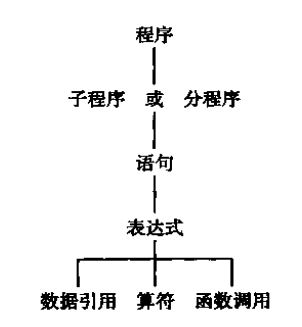

# Compile_lab

对项目的开发过程进行详细的描述

## lexical

词法分析器算法描述，输出格式说明， 源程序编译步骤；

### 分析过程

1. 手写c--的正则表达式
2. 将正则表达式转换成后缀表达式
3. 根据后缀表达式构造Rules
4. 根据Rules构造NFA
    1. [参考1](https://blog.csdn.net/m0_52293362/article/details/126368664?ops_request_misc=%257B%2522request%255Fid%2522%253A%2522166575589816782417024237%2522%252C%2522scm%2522%253A%252220140713.130102334.pc%255Fall.%2522%257D&request_id=166575589816782417024237&biz_id=0&utm_medium=distribute.pc_search_result.none-task-blog-2~all~first_rank_ecpm_v1~rank_v31_ecpm-7-126368664-null-null.142^v56^control,201^v3^control&utm_term=%E6%AD%A3%E5%88%99%E8%A1%A8%E8%BE%BE%E5%BC%8F%E6%9E%84%E9%80%A0nfa&spm=1018.2226.3001.4187)
    2. [参考2](https://blog.csdn.net/tch3430493902/article/details/102489344?spm=1001.2101.3001.6650.7&utm_medium=distribute.pc_relevant.none-task-blog-2%7Edefault%7EBlogCommendFromBaidu%7ERate-7-102489344-blog-102981220.t0_edu_mix&depth_1-utm_source=distribute.pc_relevant.none-task-blog-2%7Edefault%7EBlogCommendFromBaidu%7ERate-7-102489344-blog-102981220.t0_edu_mix&utm_relevant_index=14)
5. NFA确定化
    - zwh
        - https://blog.csdn.net/qq_45180475/article/details/107831690

6. DFA最小化 
7. 根据DFA分析程序 TODO
    1. 根据传入字符串构造token TODO
    2. 正则表达式关键字的翻译 好像不用
    3. 后缀表达式修改

### 1 手写c--的正则表达式

### 2 将regex转换为re_postfix

### 3 根据re_postfix构造Rules

### 4 根据Rules构造FA

fa的数据结构

```python
def __init__(self, k: set[str],
             letters: set[str],
             f: dict[tuple[str, str], set[str]],  # 转换函数 存储start letter ends
             s: str,
             z: set[str]):
  self.k = k  # 状态集
  self.letters = letters  # 字母表
  self.f = f  # 转换函数集 示例 f(S,0)={V,Q} 那么在list中存入的是 ( (S,0) , [V,Q] )
  self.s = s  # 唯一初态
  self.z = z  # 终态集
```

rules与fa的f（转换函数）极为相似，因此构造较为简单

1. 维护一个栈，将起始rules的start压栈，并且根据rules的start赋值fa的初态
2. 不断从栈中推出state并且据此维护fa的状态集和字符集，根据state的两个transition得到与其联系的state压入栈中

### 5 将FA确定化

### 6 将DFA最小化

### 7 根据DFA分析程序

### 附录1graph

调用了graphviz库，将dfa方便的可视化，便于调试程序以及看到结果

```python
def graph_dfa_print(dfa: DFA):  # 画NFA的图像

  g = Digraph('G', filename='DFA' + str(Graph.dfa_name) + '.gv', format='png')
  for f in dfa.f.items():
    g.edge(f[0][0], f[1], f[0][1])

    g.node(dfa.s, color='res')  # 开始节点红色
    for z in dfa.z:
      g.node(z, shape='doublecircle')  # 结束节点双层

      Graph.dfa_name += 1

      g.view()
```

## syntax

（2）语法分析器的算法描述，创建的分析表（预测分析表、LR 分析表等），输出格式说明，源程序编译步骤。

1. 手动构造c--文法
    - 
2. 根据token串将其理解为各类语法单位：短语、子句、程序段、程序。输出语法树

### syntax_bottom_up LL

#### LL(1) 每一步只向前查看一个符号

1. 消除左递归
    1. 消除一个产生式直接左递归
    2. 消除一个文法的左递归
2. 消除回溯、提取左因子
    - 反复提取所有非终结符左因子，使得一个文法的所有非终结符的所有候选首符集两两不相交


LL(1)分析条件：

1. 一个文法不含左递归
2. 所有非终结符的所有候选首符集两两不相交
3. 对于每个非终结符A，若某个候选首符集包含$\epsilon$，那么他的First与Follow集交集为空

前两点可以通过算法解决，最后一点c--不一定符合，如果c--不符合，还需要回溯机制

### syntax_top_down LR

#### 算符优先分析法

#### LR分析法

## Semantic

（3）存储，遍历语法树的过程算法伪代码，以及调用中端的过程的算法设计思想。 

1. 静态语义检查
2. 中间代码的翻译
