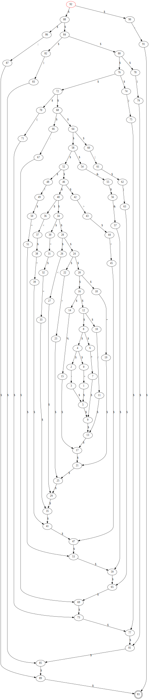
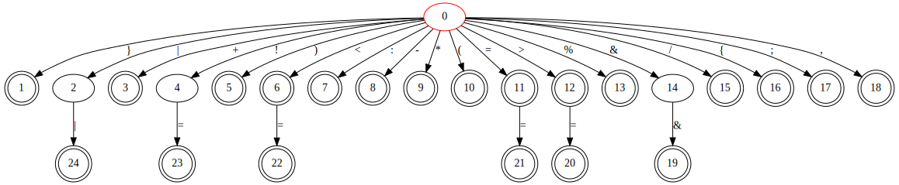
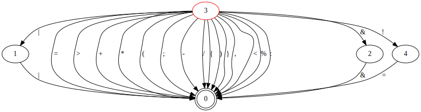

# Compile_lab_report

对项目的开发过程进行详细的描述

## lexical

词法分析器算法描述，输出格式说明， 源程序编译步骤；

### 分析过程

#### 1 手写c--的正则表达式

##### IDN

```python
_IDN = '(' + ascii_lowercase + '|' + ascii_uppercase + '|_).(' + ascii_lowercase + '|' + ascii_uppercase + '|' + digits
```

##### INT

```python
_INT = '(' + digits_without_zero + ').(' + digits + ')*|0'
```

##### 其余部分

```python
'+|' + \
'-|' + \
'\\*|' + \
'/|' + \
'%|' + \
'=|' + \
'>|' + \
'<|' + \
'=.=|' + \
'<.=|' + \
'>.=|' + \
'!.=|' + \
'&.&|' + \
'\\|.\\||' + \
':|' + \
'\\(|' + \
'\\)|' + \
'{|' + \
'}|' + \
';|' + \
','
```

#### 2 将regex转换为re_postfix 

###### 正则表达式转为后缀表达式以便于后续Rules的构造以及FA的生成


在处理正则表达式时，对于正则表达式的关键字（运算符）需要特别注意，除此之外，由于  ||  类似需要匹配的正则式的出现需要借助\\转义字符来处理冲突

```
		  '*': ,  # 闭包
           '.': ,  # 连接
           '|': ,  # 或
           '(': ,  # 左括号
           ')':    # 右括号
           \\ :    # 转义字符处理与运算符的冲突
```


     核心思想：1 循环开始：
    
      			1.1:如果是字符，加入postfix
    
      			1.2：如果是运算符，如果堆栈为空，直接入stack
      				1.2.1： 	如果该字符是左括号时，直接放入堆栈
    
    				1.2.2：	如果该字符是右括号时，一直输出栈顶元素，直到遇见左括号为止break:
     				
     				1.2.3：	如果是非（）运算符那么遍历stack元素 一直输出优先级>=当前符号的 当遇到其他字符时（如左括号）或堆栈空时break
     				
     		  2，循环结束，输出堆栈中剩余运算符
    

```python
def get_re_postfix(re: str) -> str:  # 得到后缀表达式 a.b -> ab.
    postfix = deque()
    stack = deque()

    # Loop through the string one character at a time
    it = iter(range(len(re)))
    for i in it:
        if re[i] == '(':
            stack.append(re[i])
        elif re[i] == ')':
            while stack[-1] != '(':
                postfix.append((stack.pop()))
            # Remove '(' from stack
            stack.pop()
        elif re[i] in Regex.keyword:  # re[i] is keyword
            while stack and Regex.keyword[re[i]] <= Regex.keyword.get(stack[-1], 0):
                postfix.append((stack.pop()))
            stack.append(re[i])
        elif re[i] == '\\':
            postfix.append(re[i])
            # postfix.append(re[i])
            postfix.append(re[i + 1])
            next(it)
        else:
            postfix.append(re[i])

    while stack:
        postfix += (stack.pop())

    res = ''
    while postfix:
        res += postfix.popleft()
    return res
```

#### 3 根据re_postfix构造Rules TODO

1. [参考1](https://blog.csdn.net/m0_52293362/article/details/126368664?ops_request_misc=%257B%2522request%255Fid%2522%253A%2522166575589816782417024237%2522%252C%2522scm%2522%253A%252220140713.130102334.pc%255Fall.%2522%257D&request_id=166575589816782417024237&biz_id=0&utm_medium=distribute.pc_search_result.none-task-blog-2~all~first_rank_ecpm_v1~rank_v31_ecpm-7-126368664-null-null.142^v56^control,201^v3^control&utm_term=%E6%AD%A3%E5%88%99%E8%A1%A8%E8%BE%BE%E5%BC%8F%E6%9E%84%E9%80%A0nfa&spm=1018.2226.3001.4187)

2. [参考2](https://blog.csdn.net/tch3430493902/article/details/102489344?spm=1001.2101.3001.6650.7&utm_medium=distribute.pc_relevant.none-task-blog-2%7Edefault%7EBlogCommendFromBaidu%7ERate-7-102489344-blog-102981220.t0_edu_mix&depth_1-utm_source=distribute.pc_relevant.none-task-blog-2%7Edefault%7EBlogCommendFromBaidu%7ERate-7-102489344-blog-102981220.t0_edu_mix&utm_relevant_index=14)

   State的数据结构

   ```python
   def __init__(self, is_end: bool):
       self.is_end = is_end
       self.flag = State.get_flag()  # 状态转换图 标号
       self.transitions = {}
       self.epsilonTransitions = []
       State.__STATE_ALL.add(self)
       State.flag_plus()
   ```

   Rules的数据结构

   ```python
   def __init__(self, start: State, end: State):
       self.start = start
       self.end = end
   ```

   给状态添加转换

   ```python
   @staticmethod
   def __epsilon_transition(pre: State, nxt: State):  # 创建 epsilon transition
       pre.epsilonTransitions.append(nxt)
   
   @staticmethod
   def __letter_transition(pre_state: State, next_state: State, letter: str):  # 创建 普通 transition
       pre_state.transitions[letter] = next_state
   ```

   创建两种基础Rules:

   ```python
   @staticmethod
   def __epsilon_rules() -> tuple[State, State]:  # 创建 epsilon 规则
       start = State(False)
       end = State(True)
       Rules.__epsilon_transition(start, end)
   
       return start, end
   
   @staticmethod
   def __letter_rules(letter) -> tuple[State, State]:  # 创建普通规则
       start = State(False)
       end = State(True)
       Rules.__letter_transition(start, end, letter)
   
       return start, end
   
       @staticmethod
       def get_epsilon_rules():
           start, end = Rules.__epsilon_rules()
           return Rules(start, end)
   
       @staticmethod
       def get_single_letters_rules(letter):
           start, end = Rules.__letter_rules(letter)
           return Rules(start, end)
   ```

   |  *  . 三种运算符对应的Rules

   ```python
   @staticmethod
   def get_concat_rules(pre_rules, next_rules):
       Rules.__epsilon_transition(pre_rules.end, next_rules.start)
       pre_rules.end.is_end = False
   
       return Rules(pre_rules.start, next_rules.end)
   
   @staticmethod
   def get_union_rules(pre_rules, next_rules):
   
       start = State(False)
       Rules.__epsilon_transition(start, pre_rules.start)
       Rules.__epsilon_transition(start, next_rules.start)
   
       end = State(True)
       Rules.__epsilon_transition(pre_rules.end, end)
       pre_rules.end.is_end = False
       Rules.__epsilon_transition(next_rules.end, end)
       next_rules.end.is_end = False
   
       return Rules(start, end)
   
   @staticmethod
   def closure(rules):
       start = State(False)
       end = State(True)
   
       Rules.__epsilon_transition(start, end)
       Rules.__epsilon_transition(start, rules.start)
   
       Rules.__epsilon_transition(rules.end, end)
       Rules.__epsilon_transition(rules.end, rules.start)
   
       rules.end.is_end = False
   
       return Rules(start, end)
   ```

   ###### 从后缀表达式中获取Rules

   核心思想：创建一个栈（stack)，并从左往右以此读取pofix.

   ​	1.若读取的是字符，创建字符Rules,压入栈中

   ​	2.若读取的是操作符，弹出栈中内容，创建操作符Rules,再压入栈

   

   ```python
   @staticmethod
       def init_by_re_postfix(re_postfix):
           State.reset()
           if re_postfix == '':
               return Rules.get_epsilon_rules()  # fa 的转换函数
           stack = deque()
           it = iter(range(len(re_postfix)))
           for i in it:
               if re_postfix[i] == '.':
                   assert len(stack) >= 2, 'stack: ' + str(stack)
                   rules_nxt = stack.pop()
                   rules_pre = stack.pop()
                   new_rules = Rules.get_concat_rules(rules_pre, rules_nxt)
                   stack.append(new_rules)
               elif re_postfix[i] == '|':
                   rules_nxt = stack.pop()
                   rules_pre = stack.pop()
                   new_rules = Rules.get_union_rules(rules_pre, rules_nxt)
                   stack.append(new_rules)
               elif re_postfix[i] == '*':
                   rules = stack.pop()
                   new_rules = Rules.closure(rules)
                   stack.append(new_rules)
               elif re_postfix[i] == '\\':
                   rules = Rules.get_single_letters_rules(re_postfix[i + 1])
                   stack.append(rules)
                   next(it)
               else:
                   rules = Rules.get_single_letters_rules(re_postfix[i])
                   stack.append(rules)
           return stack.pop()
   ```


#### 4 根据Rules构造FA

fa的数据结构

```python
def __init__(self, k: set[str],
             letters: set[str],
             f: dict[tuple[str, str], set[str]],  # 转换函数 存储start letter ends
             s: str,
             z: set[str]):
  self.k = k  # 状态集
  self.letters = letters  # 字母表
  self.f = f  # 转换函数集 示例 f(S,0)={V,Q} 那么在list中存入的是 ( (S,0) , [V,Q] )
  self.s = s  # 唯一初态
  self.z = z  # 终态集
```

rules与fa的f（转换函数）极为相似，因此构造较为简单

1. 维护一个栈，将起始rules的start压栈，并且根据rules的start赋值fa的初态
2. 不断从栈中推出state并且据此维护fa的状态集和字符集，根据state的两个transition得到与其联系的state压入栈中

#### 5 将NFA确定化

**输入**:一个 NFA N
**输出**:一个接受(识别)相同语言的 DFA M

利用构造 $\epsilon-$ 闭包的方法将NFA确定化为DFA

##### $\epsilon - $闭包

设 I 是 NFA N 的一个状态子集, $\epsilon - CLOSURE(I)$ 定义如下:

1. 若 $s \in I$, 则 $s \in \epsilon - CLOSURE(I)$
2. 若 $s \in I$, 那么从 $s$ 出发经过任意 $\epsilon$ 则到达的任何状态 $s'$, $s' \in \epsilon - CLOSURE(I)$

##### 算法过程

1. 置 DFA M 中的状态集 k' 和 z' 为 $\empty$ 集
2. 给出 M 的初态 $s' = \epsilon - CLOSURE({S})$, 并把 $s'$ 压入待访问状态栈
3. 对于待访问状态栈: 如果栈不为空, 则推出一个状态 $T={q_1,q_2,...,q_n}$ , 
   1. 将 $T$ 加入到已访问状态 set 中
   2. 如果 $T$ 含有一个 N 的终态 那么 $T$ 是 M 的终态
   3. 对于每个 $a \in letters$
      1. $J =f({q_1,q_2,...,q_n},a)=f(q_1,a)\cup f(q_2,a) \cup ... \cup f(q_n,a)$
      2. $U = \epsilon - CLOSURE(J)$
      3. 如果 $J$ 不在已访问set中 将 $J$ 加入待访问状态栈 
   4. 如果 $U$ 不在
4. 重复步骤4，直到栈为空

##### 示例

###### FA

<div STYLE="page-break-after: always;"></div>



<div STYLE="page-break-after: always;"></div>

###### DFA



#### 6 将DFA最小化 TODO

###### 最小化前


###### 最小化后



最小化的主要步骤：

1. 根据传入的DFA构造出划分集合

   ##### 借助Hopcroft算法实现：Hopsroft 算法就是先根据非终结状态与非终结状态将所有的节点分为 N 和 A 两大类。 N 为非终结状态，A 为终结状态，之后再对每一组运用基于等价类实现的切割算法

   ```python
   def get_final_split_set(dfa: DFA) -> List[Set[str]]:  # 获得dfa的集合划分
       p = [dfa.k - dfa.z, dfa.z]
       w = [dfa.k - dfa.z, dfa.z]
       while w:
           s = random.choice(w)
           w.remove(s)
   
           for char in dfa.letters:
               la = get_source_set(s, char, dfa)
               for R in p:
                   r1 = la & R
                   r2 = R - r1
                   s3 = R - la
                   if len(r1) and len(s3):
                       p.remove(R)
                       p.append(r1)
                       p.append(r2)
   
                       if R in w:
                           w.remove(R)
                           w.append(r1)
                           w.append(r2)
                       else:
                           if len(r1) <= len(r2):
                               w.append(r1)
                           else:
                               w.append(r2)
       return p
   ```

2. 根据划分集合构造最小化DFA

   ###### dfa.letters:	与最小化之前一致 

   ```python
   m_dfa_letters = dfa.letters
   ```

   ###### dfa.k:	根据划分后的集合，为每一个集合构造生成一个新的state来表示，并用字典存储对应关系

   ```python
   set2flag = dict()
   for state_set in p:  # 为划分后的内部每个集合分配一个flag并存到字典
       set2flag[tuple(state_set)] = GetNewK.get_flag()
   ```

   ###### dfa.s以及dfa.z(初态以及终态):	遍历传入的DFA的状态集，如果是终态或者初态，去划分后构造的DFA里寻找所在集合的state，并将其所在的state加入终态集或初态集

   ```python
   for state in dfa.k:
       if state in dfa.s:
           m_dfa_s = set2flag[tuple(get_state_located_set_flag(p, state))]
       if state in dfa.z:
           if (set2flag[tuple(get_state_located_set_flag(p, state))]) not in m_dfa_z:
               m_dfa_z.add(set2flag[tuple(get_state_located_set_flag(p, state))])
   ```

   ###### dfa.f:	遍历选出的代表状态以及字符集合，如果所选取的二元组在原DFA存储的规则中，将转换前的状态和转换后的状态分别转换成当下所在集合的转状态并存入dfa.f

   ```python
   for state in representative_set:  # 遍历代表集合以获得m_dfa_f
       for letter in dfa.letters:
           if (state, letter) in dfa.f.keys() and m_dfa_f.get(
                   (set2flag[tuple(get_state_located_set_flag(p, state))], letter), '#') == '#':
               m_dfa_f[(set2flag[tuple(get_state_located_set_flag(p, state))], letter)] = set2flag[
                   tuple(get_state_located_set_flag(p, dfa.f.get((state, letter))))]
   ```

DFA五元组分别获取，传入构造函数即可完成最小化

#### 7 根据DFA分析程序 

###### 本部分实现思路为：按行读入字符串，对于每行字符串进行处理得到词并构造成Token加入List后，将每行得到的List合并，对于字符串的处理如下：

如果pre指针没有指向字符串的末尾，循环执行如下的分析：

  1. 如果读入的字符是//，则代表注释，不对之后的内容进行分析
  2. 如果读入的字符是' ' 、 '\r' 、'\t'等此类在程序中经常出现作为格式但无实际意义的字符，跳过此次分析
  3. 如果此次读入的字符与当前状态所组成的key在dict中有value，那么不断迭代状态和字符，直至不再满足识别条件，并将这个词加入res中

```python
def get_token_list_by_line_dfa(dfa: DFA, line: str) -> List[Token]:
    res: List[Token] = []
    pre = nxt = 0  # 指针指向当前识别单词首位和正在识别的位置
    now_state = dfa.s
    isEnd = 0
    while pre != len(line):
        if line[nxt:nxt + 2] == '//':
            break

        if line[nxt] == ' ' or line[nxt] == '\r' or line[nxt] == '\t':
            pre += 1
            nxt += 1
            continue
        
         if line[nxt] not in dfa.letters:
            print('Unsupported characters in the program')

        while (now_state, line[nxt]) in dfa.f.keys() and dfa.f.get((now_state, line[nxt]), '') in dfa.f.values():
            if nxt == len(line) - 1:
                isEnd = 1
                break
            now_state = dfa.f.get((now_state, line[nxt]))
            nxt += 1

        res.append(get_token_by_content(line[pre:nxt + isEnd]))

        if isEnd == 1:
            break
        pre = nxt
        now_state = dfa.s

    return res
```

### 输出格式说明

[待测代码中的单词符号] [TAB] <[单词符号种别],[单词符号内容]>

### 附录1 graph

调用了graphviz库，将dfa方便的可视化，便于调试程序以及看到结果

```python
def graph_dfa_print(dfa: DFA):  # 画NFA的图像

  g = Digraph('G', filename='DFA' + str(Graph.dfa_name) + '.gv', format='png')
  for f in dfa.f.items():
    g.edge(f[0][0], f[1], f[0][1])

    g.node(dfa.s, color='res')  # 开始节点红色
    for z in dfa.z:
      g.node(z, shape='doublecircle')  # 结束节点双层

      Graph.dfa_name += 1

      g.view()
```

导出为svg图片

```shell
 dot DFA.gv -T svg -o dfa.svg
```

## syntax

（2）语法分析器的算法描述，创建的分析表（预测分析表、LR 分析表等），输出格式说明，源程序编译步骤。

1. 手动构造c--文法
    - 
2. 根据token串将其理解为各类语法单位：短语、子句、程序段、程序。输出语法树

### syntax_bottom_up LL

#### LL(1) 每一步只向前查看一个符号

1. 消除左递归
   1. 消除一个文法的左递归
   2. 消除一个产生式直接左递归
2. 消除回溯、提取左因子
    - 反复提取所有非终结符左因子，使得一个文法的所有非终结符的所有候选首符集两两不相交


LL(1)分析条件：

1. 一个文法不含左递归
2. 所有非终结符的所有候选首符集两两不相交
3. 对于每个非终结符A，若某个候选首符集包含$\epsilon$，那么他的First与Follow集交集为空

前两点可以通过算法解决，最后一点c--不一定符合，如果c--不符合，还需要回溯机制

### syntax_top_down LR

#### 算符优先分析法

#### LR分析法

## Semantic

存储，遍历语法树的过程算法伪代码，以及调用中端的过程的算法设计思想。 

1. 静态语义检查
2. 中间代码的翻译
